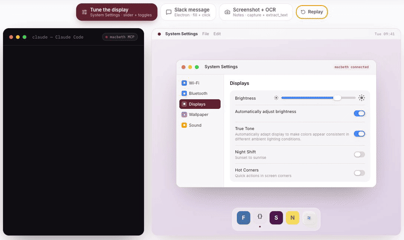

<p align="center">
  
</p>

<h1 align="center">Macbeth — Open-source Computer Use for macOS</h1>

<p align="center">
  <strong>Give the agent you already use hands and eyes on your Mac.</strong>
</p>

<p align="center">
  See and operate native AppKit and Electron applications through MCP or TypeScript.
</p>

<p align="center">
  Structured UI access when possible. Screenshots and OCR when necessary.<br />
  <em>Think Playwright for your entire Mac.</em>
</p>

<p align="center">
  <a href="https://www.npmjs.com/package/macbeth"></a>
  
  
  
</p>

<p align="center">
  
</p>

<p align="center">
  <sub>Simulated walkthrough of Macbeth's current MCP tool surface: System Settings, Electron interaction, and screenshot/OCR.</sub>
</p>

<p align="center">
  <a href="#quickstart">Quickstart</a> ·
  <a href="#across-your-mac">Examples</a> ·
  <a href="#why-macbeth">Why Macbeth?</a> ·
  <a href="#typescript-api">TypeScript</a> ·
  <a href="#security-and-limitations">Security</a> ·
  <a href="#teach-macbeth-an-application">Skills</a>
</p>

## Quickstart

Give Claude Code access to Macbeth:

```bash
claude mcp add macbeth -- npx -y macbeth
```

Then ask it to verify the connection:

> Using Macbeth, list the running applications, connect to Finder, inspect its front window, and summarize the first few controls you can see. Do not perform any other actions.

Macbeth ships with a prebuilt, signed and notarized universal daemon. No Swift toolchain or manual service installation is required. If setup fails, run `npx macbeth doctor`; it prints a self-contained diagnostic prompt you can paste back into your agent.

Any MCP client that can launch a stdio server can use `npx -y macbeth`. See [MCP setup](docs/mcp.md) for generic configuration, updates, and the complete tool list.

<details>
<summary>Let your agent guide the installation</summary>

> Add Macbeth as an MCP server using `npx -y macbeth`. Run `npx macbeth doctor`, guide me through granting only the permissions I need, and verify the setup by inspecting Finder. Do not take any unrelated actions.

</details>

## Across your Mac

### Work inside Unity, Logic Pro, and other complex tools

> “In Logic Pro, set the project tempo to 128 BPM and start playback.”

Macbeth combines structured controls, menus, keyboard input, screenshots, OCR, and application-specific guidance. Logic Pro has a bundled [dedicated skill](skills/LogicPro/SKILL.md); thin accessibility trees in applications such as Unity may require more fallback strategies.

### Automate macOS itself

> “Open System Settings, find the firewall controls, and report their current state without changing anything.”

Macbeth can inspect named controls and values, select native menu items, and use keyboard input when a semantic action is unavailable.

### Use applications even when they have no API

> “Open HEY, find the newest visible thread from the design team, and summarize it without sending or changing anything.”

Macbeth can work through an Electron application's exposed interface even when its service does not offer the API your agent needs. HEY is an example of generic Electron control, not a dedicated Macbeth skill. The exact tree varies by application and version; see the [Electron skill](skills/electron/SKILL.md).

### See what the accessibility tree misses

> “Capture the frontmost Notes window and extract all visible text.”

ScreenCaptureKit screenshots and local Vision OCR provide a fallback for content that macOS does not expose as useful accessibility data.

### Build repeatable scripts and tests

The same engine is available as a TypeScript API with lazy locators, auto-waiting actions, explicit state waits, screenshots, and application connections.

> [!IMPORTANT]
> Macbeth can act inside applications on your behalf. Connect only trusted agents and require approval for consequential actions.

## Why Macbeth?

- **Use your own agent.** Macbeth is a control layer, not a model or agent runtime.
- **Structured when possible.** Query roles, labels, values, enabled state, hierarchy, and stable handles instead of relying only on coordinates.
- **Visual when necessary.** Fall back to window capture and OCR when accessibility metadata is thin.
- **Application-aware.** Versioned skills preserve workflows, shortcuts, and known failure modes.
- **Scriptable.** Use the same primitives interactively over MCP or directly from TypeScript.

### Structured before pixels

| Capability | Typical screenshot-driven agent | Macbeth |
|---|---|---|
| Find a labeled control | Visual inference | Accessibility query when exposed |
| Read role, value, and state | Inferred | Structured attributes |
| Wait for a UI change | Usually observed through repeated captures | Explicit waits and auto-waiting actions |
| Handle incomplete UI metadata | Vision/OCR | Accessibility first, screenshot/OCR fallback |
| Reuse application knowledge | Prompt-dependent | Bundled, versioned skills |

Accessibility information can itself be incomplete or misleading. Macbeth is a hybrid interface: it uses stronger structured primitives when macOS exposes them and keeps visual and system-level fallbacks available when it does not.

## Security and limitations

- Macbeth requires macOS 14 or newer and Node.js 20 or newer.
- Accessibility permission is required for UI inspection and interaction. Screen Recording is required only for screenshots and window OCR.
- Application accessibility quality varies. Custom-rendered canvases, games, and some creative tools may require menus, screenshots, OCR, keyboard input, or application-specific guidance.
- Interface changes between application versions can break specialized workflows.
- The interaction glow makes Macbeth activity visible, but it is not an approval system or a complete audit log.
- Agents can make mistakes. Use human review for destructive, financial, publishing, or privacy-sensitive actions.

Macbeth uses a local stdio MCP server and a Unix-domain socket; it does not open a TCP listener. Screenshots requested through MCP are written to a temporary directory and are not automatically deleted. Read the [security model](SECURITY.md) for data flow, permission revocation, local-process risks, and safer operating practices.

## TypeScript API

```bash
npm install macbeth
```

```ts
import { connect } from "macbeth";

const app = await connect("TextEdit");
await app.window("Untitled").textField().fill("Hello from Macbeth");
await app.pressKey("s", ["cmd"]);
```

See [Developing with Macbeth](skills/DEVELOPING_MACBETH.md) for locators, screenshots, Electron behavior, lifecycle, and tests.

## Teach Macbeth an application

A Macbeth skill is a `SKILL.md` file, optionally accompanied by runnable scripts, that teaches an agent an application's reliable workflows and pitfalls. Bundled skills cover Calendar, Contacts, Logic Pro, Mail, Maps, Messages, Music, Notes, Reminders, Safari, System Settings, and generic Electron applications.

You can add a skill without changing the Swift daemon. Start with the [contribution guide](CONTRIBUTING.md#contributing-an-application-skill) and include a reproducible prompt, tested application version, expected result, and honest failure modes.

## Documentation

| Guide | Contents |
|---|---|
| [MCP server](docs/mcp.md) | Installation, smoke test, tools, skills, and updates |
| [TypeScript API](skills/DEVELOPING_MACBETH.md) | Client API, locators, Electron, and tests |
| [Architecture](docs/architecture.md) | Daemon, protocol, fallbacks, and design notes |
| [Security](SECURITY.md) | Trust boundaries, data handling, and permission revocation |
| [Troubleshooting](TROUBLESHOOTING.md) | Diagnostics and common setup failures |
| [Contributing](CONTRIBUTING.md) | Development workflow and application skills |

## Requirements

- macOS 14 (Sonoma) or later
- Node.js 20+
- Swift 6.0+ only when building the daemon from source

## License

MIT
